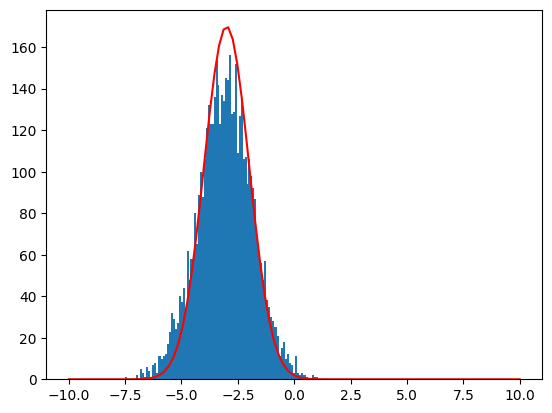

# Flow Matching with Policy Gradient Experiment
Hi, I'm an undergraduate who is currently learning generative model and reinforcement learning. This repo implement flow matching with policy gradient in pytorch framework. I implement this for deepening my understanding of flow matching and RL. And I think I've learned a lot from it, but it's also made me more conscious of where I still need to grow. There may some mistake in reports, I'll be gracefull if you could point it out :)

Mainly references:

[Flow Matching Policy Gradient](https://flowreinforce.github.io/)

[Flow-GRPO: Training Flow Matching Models via Online RL](https://github.com/yifan123/flow_grpo)

## The Toy example

The generative model can be used to fit the distribution of a given datasets. I feel a little confused when hearing the concept. So, to make it intuitive and also to make it more easy to code, in `toy.ipynb`, I first use $N(0, 1)$ as the init distribution, and training a flow matching to match a target distribution $N(4, 1)$. I tried two kinds of loss:

$$
L_{cfm1} = ||u - v_\theta(xt, t)||_2^2
$$

$$
L_{cfm2} = ||x_1 - (x_t - t v_\theta(xt, t))||_2^2
$$

I find the second result is **a little bit** better than the first one.

However, the generative model has its limitation on finding optimal solution, while the reinforcement learning is used to find an optimal solution under the Markov-Decision-Process with human defined rewards. That's to say, if we use a rl to training a generative model, the output distribution of the generative model should match the reward curve. So, at the next step, based on the model trained at the first stage, I use $N(1, 1)$ as the reward function, hope the output distribution of the trained model can match it. We follow the ppo loss:

$$
L_{fpo} = \max_\theta \min(r(\theta) A_t, clip(r(\theta), 1-\epsilon, 1 + \epsilon)A_t)
$$

However, based on the complexity of the generative model and the multi-steps in genertive model, there are different choices that I have known of $r(\theta), A_t$.

$$
r(\theta) = \exp(L_{cfm}(\theta_{old}) - L_{cfm}(\theta))
$$

PPO Critic:

$$
A_t = \sum_t \gamma^t r_t - V_\phi(x)
$$

GRPO:

$$
A_t = (r^i - mean(r)) / std(r)
$$

For convenient, I do not use $V_\phi$ to estimate value function. In my implementation, I originally choice GRPO as my advantage value, but I find this choices greatly instable. Although in small steps, the result is good, as the rl steps goes to $1000$, the result distribution is very unlike the target reward function. (***TODO: figure out the reason why***)

I tried another advantage function:

$$
A_t = r^i / std(r)
$$

The model can also fit to the reward function curve and is stable enough to even $10000$ steps. 

### The gain from toy example

In model training, the rigorous mathematical reasoning seems not very important, as long as you can explain your equation and it's a little bit reasonable in math, the idea may be high probability work?(humm...) 

## Things to do later...
In the learning process, I searched some papers to read, and find some of them may be helpful for deepening my understand of reinforcement learning and generative model.

*[Reinforcement Learning and Control as Probabilistic Inference: Tutorial and Review](https://arxiv.org/abs/1805.00909)

*[Training Diffusion Models with Reinforcement Learning](https://arxiv.org/abs/2305.13301)

*[Stochastic interpolants: A unifying framework for flows and diffusions.](https://github.com/malbergo/stochastic-interpolants)

[Diffusion Guidance Is a Controllable Policy Improvement Operator](https://arxiv.org/pdf/2505.23458)

[Awesome diffusion model in rl](https://github.com/opendilab/awesome-diffusion-model-in-rl)

[Diffusion Models for Reinforcement Learning: A Survey](https://arxiv.org/pdf/2311.01223)

[The Evidence Lower Bound](https://en.wikipedia.org/wiki/Evidence_lower_bound)

Besides the reading list, I'm going to implement some more hard distribution.

[ ]: Bimodel normal distribution.

[ ]: In Gym Env.